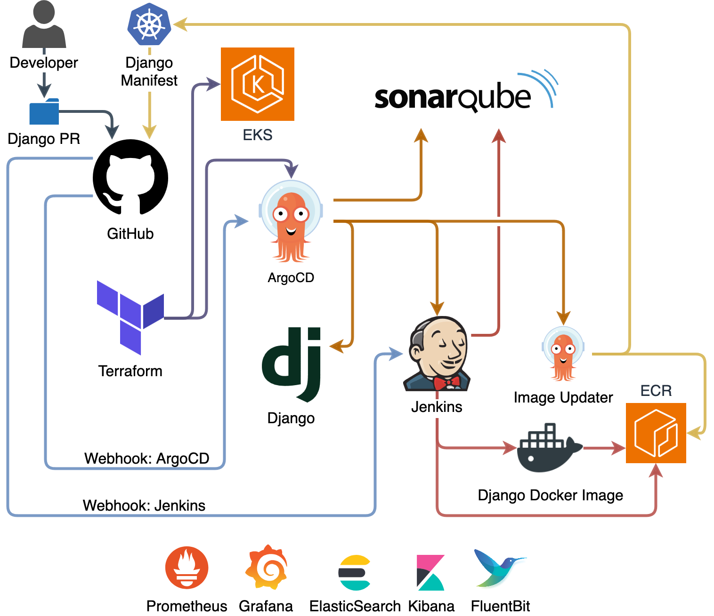

# Zero-Touch Provisioning & Deployment of Kubernetes CI/CD Pipeline



A Proof of Concept (PoC) that provisions a fully operational EKS cluster using terraform, and deploys a sample full-stack Django application along with an interconnected CI/CD pipeline made of ArgoCD, Jenkins, Prometheus, Grafana, Elasticsearch, Fluentbit, and Kibana.

All with dynamic configuration values, CNAME entries, secure credentials, and requires no manual intervention after issuing a `terraform apply` command only once.

A full breakdown can be found at my [blogpost](https://tbalza.net/zero-touch-provisioning-deployment-of-kubernetes-ci/cd-pipeline/)

> **Warning**: Creating resources in AWS will incur costs. Remember to use the `terraform destroy` command at the end to remove all resources after you're finished.

## Directory Structure

```bash
┌── argo-apps                       # Deployment Stage Addons/Apps
│   ├── argocd 
│   ├── argocd-image-updater
│   ├── django
│   ├── eck-stack
│   ├── fluent
│   ├── jenkins
│   ├── prometheus
│   └── sonarqube
├── django-todo                     # Main App Developement
└── terraform
    ├── 01-eks-cluster              # Terraform Infra Provisioning Stage
    └── 02-argocd                   # Terraform ArgoCD Boostrap Stage
```

## Requirements
With [Homebrew](https://docs.brew.sh/Installation) (Mac):
```bash
/bin/bash -c “$(curl -fsSL https://raw.githubusercontent.com/Homebrew/install/HEAD/install.sh)"
```
Install the necessary CLI tools,
```bash
brew install git # git
brew install gh # github cli
brew install brew tap hashicorp/tap && brew install hashicorp/tap/terraform # terraform
brew install awscli # aws-cli
brew install helm # helm
brew install kubectl # kubectl
```
### AWS CLI
Configure the [AWS CLI tool](https://docs.aws.amazon.com/cli/latest/userguide/getting-started-install.html) with your user. Optionally create an [Isolated Testing Account](https://docs.aws.amazon.com/organizations/latest/userguide/orgs_tutorials_basic.html) for more granular access control and budget limits.

This assumes you have the credentials that contain your `aws_access_key_id` and your `aws_secret_access_key` for your IAM User with required permissions.

```bash
aws configure
```

### Git
Configure git cli username and email of your existing [GitHub account](https://github.com/login):
```bash
git config --global user.name "your-username"
git config --global user.email "your@email.com"
```

Create SSH key pair, and paste public key in https://github.com/settings/keys (Click 'New SSH Key', Paste and save):

```bash
cd ~/.ssh
ssh-keygen -t rsa -b 4096 -C "your@email.com" -f "github-personal"
ssh-add -K ~/.ssh/github-personal # `-K` argument is used only for storing the passphrase in the keychain which is optional 
pbcopy < ~/.ssh/github-personal.pub # https://github.com/settings/keys (New SSH Key, Paste)
```
### GitHub CLI

Run the `gh` command below, in the options choose SSH, your previously created public key, copy the generated one-time code, and paste the code in the resulting browser window to authenticate:
```bash
gh auth login -w -p ssh -s repo,read:org,gist,admin:public_key,admin:repo_hook && \
gh config set pager cat # disables vim console after command execution
```


## Setting up DNS, and Generating Cloudflare & GitHub Tokens
[Setup Cloudflare DNS Nameservers](https://www.namecheap.com/support/knowledgebase/article.aspx/9607/2210/how-to-set-up-dns-records-for-your-domain-in-a-cloudflare-account/).
If you bought your domain with another registrar, you can point to Cloudflare's nameservers and have access to their DNS services and API.

(ExternalDNS supports Route53, GKE, DigitalOcean, GoDaddy etc. This PoC is configured to work with Cloudflare DNS Service out of the box, but can be adapted to use most major services)

[Create Cloudflare API Token](https://dash.cloudflare.com/profile/api-tokens) with "All accounts, All Zones" permissions and set env vars. The "Zone ID" is found in the Overview page
```bash
export TF_VAR_CFL_API_TOKEN="your-cloudflare-token"
export TF_VAR_CFL_ZONE_ID="your-cloudflare-zoneid"
```

[Create GitHub Personal Access Token](https://github.com/settings/tokens/). Click on "Generate new token (Classic)", tick "repo" permissions, and save. Set env vars,

```bash
export TF_VAR_ARGOCD_GITHUB_TOKEN="you-github-token" # token and login password are two different things
export TF_VAR_ARGOCD_GITHUB_USER="your-github-user"
```
Optionally you can rename/edit `/terraform/01-eks-cluster/sample-dot-tfvars` to avoid having to set ENV vars on each terminal session (credentials won't be committed due to .gitignore)

## Creating GitHub Repo and Webhooks

Create repo:
```bash
gh repo create kubernetes-cicd-zt.git --public
```

To create 2 [webhooks](https://docs.github.com/en/webhooks/using-webhooks/creating-webhooks). You can define your domain first with,
```bash
export KCICD_DOMAIN="yourdomain.com"
```
and execute this whole command in terminal:

```bash
export KCICD_USER="$(git config --global user.name)" && \
echo '{
  "name": "web",
  "active": true,
  "events": ["push"],
  "config": {
    "url": "https://jenkins.'"$KCICD_DOMAIN"'/github-webhook/",
    "content_type": "json"
  }
}' | gh api /repos/"$KCICD_USER"/kubernetes-cicd-zt/hooks --input - && \
echo '{
  "name": "web",
  "active": true,
  "events": ["push"],
  "config": {
    "url": "https://argocd.'"$KCICD_DOMAIN"'/api/webhook/",
    "content_type": "json"
  }
}' | gh api /repos/"$KCICD_USER"/kubernetes-cicd-zt/hooks --input -
```

## Configuring Cluster Settings

### Cloning the Repository
```bash
cd ~
git clone https://github.com/tbalza/kubernetes-cicd-zt.git && \
cd kubernetes-cicd-zt # commands and paths are relative to ~/kubernetes-cicd-zt/
```

### Terraform
Edit your domain and repo URL in `/terraform/01-eks-cluster/env-.auto.tfvars`, the rest can be left unchanged:
```hcl
TF_DOMAIN      = "yourdomain.com"
TF_REPO_URL    = "https://github.com/youruser/kubernetes-cicd-zt.git"
```
### ArgoCD
Edit the repoURL value in ArgoCD's 'ApplicationSet' `/argo-apps/argocd/applicationset.yaml`:
```yaml
spec: # add sed/yq command
  generators:
    - git:
        repoURL: https://github.com/<your-user>/kubernetes-cicd-zt.git
```

## Push Configuration Changes
Commit changes, create repo, and push changes:
```bash
git add . && \
git commit -m "configuration complete" && \
git remote add origin git@github.com:"$KCICD_USER"/kubernetes-cicd-zt.git && \
git push origin main
```

## Provisioning the Cluster

Before you apply changes the first time, you need to initialize TF working directories, which downloads plugins, modules and sets up the backend for storing your infrastructure's state by using the `init` command:
```bash
terraform -chdir="/terraform/01-eks-cluster/" init && \
terraform -chdir="/terraform/02-argocd/" init
```

Provision and deploy all apps with single compound `apply` command:
```bash
terraform -chdir="/terraform/01-eks-cluster/" apply -auto-approve && \
terraform -chdir="/terraform/02-argocd/" apply -auto-approve
```

> `terraform/01-eks-cluser` Provisions infrastructure, and core addons that don't change often. While `terraform/02-argocd` Bootstraps ArgoCD via helm, which will in turn deploy the rest of the apps. Separating these stages into two TF state files reduces future maintenance issues

## Final Results

### Provisioning
After executing `terraform apply -auto-approve`, the provisioning stage will set up the EKS cluster with Node Groups, Access Entries, along with its core addons (CoreDNS, Kube-Proxy, VPC-CNI, EBS CSI Driver, AWS Load Balancer Controller, ExternalDNS, External Secrets Operator) and resources like IAM Policies/Roles/Security Groups, ACM, VPC, RDS, SSM, Application Load Balancer, and ECR.

This provisioning cycle takes about ~25 minutes.

### Deployment

After the first stage succeeds, Terraform will automatically bootstrap ArgoCD using values generated dynamically while provisioning, where it will now "take over" and deploy a fully configured and interconnected CI/CD pipeline with Sonarqube, Jenkins, ArgoCD Image Updater, Django, ElasticSearch, Fluentbit, Kibana, Prometheus and Grafana.

After around ~10 minutes you'll be able to access all of the app console UIs via their subdomain:

- django.yourdomain.com
- argocd.yourdomain.com
- sonarqube.yourdomain.com
- jenkins.yourdomain.com
- kibana.yourdomain.com
- grafana.yourdomain.com

The dynamically generated passwords to access each service will be available via the SSM Parameter Store console in AWS. 

## Remove Resources

After you're done, you can run this command to delete all resources.

```bash
terraform -chdir="/terraform/02-argocd/" destroy ; \
terraform -chdir="/terraform/01-eks-cluster/" destroy
```

## Roadmap
Future enhancements include:

- **Security:** Scope Access Entries, IAM Policies/Roles/Security Groups, SSM, to follow the principle of least privilege. Non-root Django container
- **CI:** Code linting. CI tests. ECR Docker Caching
- **Multi Environment Setup:** Implement TF workspaces with .tfvars to enable Dev, Staging, QA, Prod, environments. Implement remote state management
- **SSO:** Configure Single Sign On for user management, and integrate with IAM permissions
- **Software Development Life Cycle:** Implement examples with trunk-based development and tags
- **Repo Structure:** Fix long .tf files, create directories for customer facing apps along with corresponding ApplicationSets
- **Crucial Addons:** Install backup/DR solutions, autoscaling, cost tracking, etc.